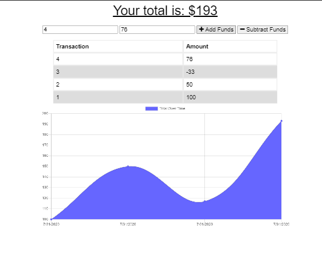

<h1 align="center">E-Commerce Back End</h1>

  

## Table of Contents
- [Description](#description)
- [Installation](#install)
- [Usage](#usage)
- [Questions](#questions)

## Description
### This is a progressive web application that allows the user to track their incoming and outgoing money transfers both on and offline. If money is changed while offline the data will persist and update when the application finds a connection.

### Screenshot of the program Insomnia, used to test the routes and tables.

## Usage
npm start
navigate to your local host

## Install
npm init  --> npm install 

## Heroku Deployment
https://secure-plateau-38484.herokuapp.com/

## Questions
## Contact me at:
### [JCSRyan](https://github.com/jcsryan)
### JohnConnorSRyan@gmail.com